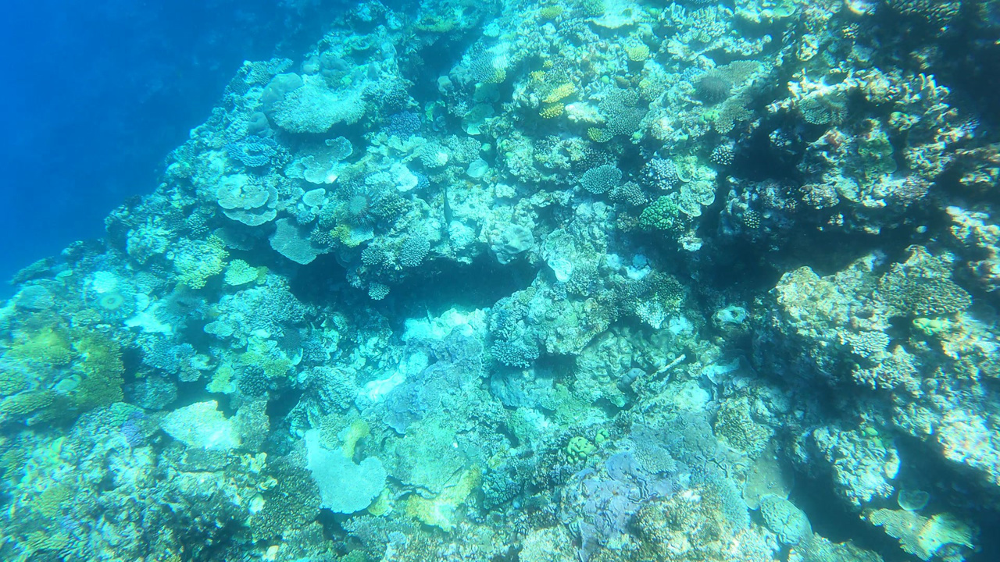
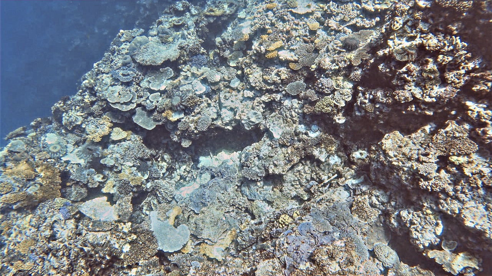

# Underwater_image_enhancement

* I have developed a trainable module in TensorFlow that utilizes evolutionary algorithms (Differential Evolution) for optimizing deep neural networks and CNNs to enhance underwater images.
* We used sum of Average image gradients and entropy as objective function inside the trainable module.
* Achieved best scores in all metrics SSIM,MSE,UIQM.
Here are the comparisons of images enhanced using this module integrated with the UWCNN network from https://github.com/saeed-anwar/UWCNN.git.

## Original Image

## Enhanced Image

